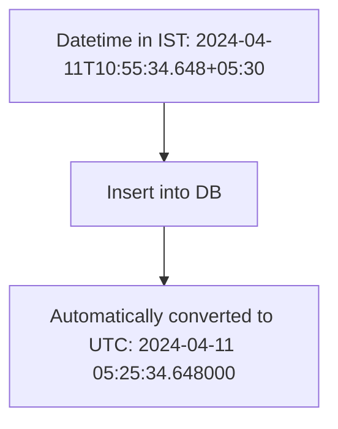

# Upgrading Ruby and Rails to YJIT: A Deep Dive into Breaking Changes, Challenges, and Code Improvements

*Date: September 13, 2024* Wip Rewriting this a little learned something new .

When we decided to upgrade our Ruby and Rails stack at work, it was clear that the journey would not be without its hurdles. Moving from **Ruby 2.6.2** to **Ruby 3.2** and **Rails 5.1.4** to **Rails 7.0.6** required not just simple version bumps but a thorough understanding of how breaking changes would impact our codebase. Add in the transition to **YJIT** (Ruby's new Just-In-Time compiler), and we had quite the challenge ahead of us. In this blog, I’ll walk you through the journey, the breaking changes we encountered, and how we overcame them with concrete examples and code snippets.

## Why the Upgrade?

The main reason for upgrading was that our current Ruby and Rails versions had reached their end-of-life (EOL). **Ruby 2.6** was no longer receiving security patches or updates, and Rails 5.1.4, while functional, had several inefficiencies that Rails 7 has since addressed. The introduction of **YJIT** in Ruby 3.1 promised substantial performance gains, and we were eager to see how that would play out in production.

## Breaking Down the Version Upgrade Process

### The Two-Branch Problem

Before upgrading, we had two branches in play: one for **Ruby 2.6 (CRuby)** and one for **JRuby**. Maintaining these two branches was crucial for us because **JRuby** provided the necessary multithreading performance for certain high-concurrency operations, while **CRuby** handled the bulk of our application logic.

#### Why We Maintained Two Branches

- **JRuby** was essential for running background jobs and handling high-concurrency workloads.
- **CRuby (Ruby 2.6)** provided better day-to-day performance for core application functionality.

However, this setup came with a cost. Each new feature or fix required deployment to **both** branches, resulting in additional complexity and time. Merging changes across these branches was tedious, often leading to deployment delays.

### Enter Ruby 3.2 and YJIT

The introduction of **YJIT** in Ruby 3.1 was a game-changer. **YJIT** compiled Ruby code just-in-time, delivering a significant performance boost without requiring a complete overhaul of our JRuby setup. With YJIT, we could effectively **merge** both branches back into a single **Ruby 3.2** branch and still retain the performance benefits we had been leveraging from JRuby.

### Pre-Upgrade Deployment with Two Branches

Before the upgrade, we had to maintain **two branches** for deployment:
1. `main` branch (for **CRuby 2.6**)
2. `jruby_main` branch (for **JRuby**)

Each branch had its own set of gem versions and `Gemfile.lock`. This setup was challenging because any change made to the `main` branch needed to be merged into the `jruby_main` branch. This often resulted in **conflicts**, especially in the **Gemfile.lock** file.

#### Pre-Upgrade Deployment Flow

Here’s how the deployment process used to work:

- Make changes to the `main` branch and ensure the CRuby-specific gems are up to date.
- Merge the `main` branch into the `jruby_main` branch, adjusting for JRuby-specific gems.
- Resolve any conflicts, especially in the `Gemfile.lock`.
- Deploy each branch to separate machines (one for CRuby, one for JRuby).
- Repeat this process for each environment (staging, UAT, production).

The need to maintain two separate gem environments and deployment pipelines for CRuby and JRuby added significant complexity.

#### Example Flowchart: Pre-Upgrade Deployment Process

<div class="mermaid">
graph TD;
    A[Update main branch] --> B[Merge into jruby_main];
    B --> C[Resolve conflicts in Gemfile.lock];
    C --> D[Deploy to separate environments];
    D --> E[Repeat for each lower environment];
</div>

This workflow not only caused delays but also increased the chance of deployment errors due to conflicts and separate environment management.

### Post-Upgrade Deployment with One Branch

After upgrading to **Ruby 3.2 with YJIT**, the **jruby_main** branch became unnecessary. We could merge everything back into a single branch, reducing the complexity significantly.

Now, we maintain only the `main` branch, where all changes are made and tested. With **YJIT** providing the necessary performance improvements, we no longer need separate JRuby optimizations.

#### Post-Upgrade Deployment Flow

- All changes are made in the `main` branch.
- No more merging or conflict resolution between branches.
- A single, streamlined deployment process to all environments.

#### Example Flowchart: Post-Upgrade Deployment Process

<div class="mermaid">
graph TD;
    A[Update main branch] --> B[Deploy directly from main];
</div>

This streamlined process has reduced our release times from **60 minutes to just 15 minutes**, eliminating the need to manage multiple branches and environments.


## The Ruby 3.2 Upgrade: Breaking Changes and How We Tackled Them

### Keyword Arguments Are Now Strictly Enforced

One of the most significant changes in **Ruby 3.2** was the way **keyword arguments** are handled. In Ruby 2.x, keyword arguments could be passed alongside regular arguments, but this flexibility led to bugs and unintended behavior. Ruby 3.2 now requires **strict separation** between positional and keyword arguments.

#### Example of Keyword Argument Enforcement

In Ruby 2.6, the following code would work:

```ruby
# Ruby 2.6 method definition
def greet(name:, age:)
  puts "Hello, #{name}! You are #{age} years old."
end

# In Ruby 2.6, you could do this:
greet(name: "Alice", age: 30)  # Works fine
greet(name: "Alice", age: 30, city: "New York")  # No error (extra argument ignored)
```

In **Ruby 3.2**, this would raise an **ArgumentError** because of the extra, unexpected keyword (`city`):

```ruby
# Ruby 3.2 stricter keyword argument handling
greet(name: "Alice", age: 30)  # Still works
greet(name: "Alice", age: 30, city: "New York")  # Raises ArgumentError
```

This change forced us to comb through our codebase and ensure every method call and definition had properly specified keywords. We also took this as an opportunity to review our method signatures for better clarity and maintainability.

### Method Visibility Changes

Another notable change was the default visibility for methods defined with `attr_reader`, `attr_writer`, and `attr_accessor`. In Ruby 2.x, these methods were **public** by default, but in **Ruby 3.2**, they are now **private** unless explicitly stated otherwise.

#### Code Example of Method Visibility Changes

```ruby
# In Ruby 2.6, this was public by default
class Person
  attr_reader :name

  def initialize(name)
    @name = name
  end
end

# In Ruby 3.2, we need to explicitly make it public
class Person
  attr_reader :name
  public :name  # Make it public manually

  def initialize(name)
    @name = name
  end
end
```

### Change in PostgreSQL Query for Datetime Objects

In **Rails 7**, there was a significant change in how **datetime objects** are handled in **PostgreSQL** queries. Specifically, datetime values that were previously stored in a specific time zone (such as **IST**) are now automatically converted to **UTC** when inserted into the database. This change impacts how time-based data is stored and retrieved, especially for applications dealing with multiple time zones.

#### Example Scenario: Event Scheduling

In **Rails 5**, when an `event_start` datetime value was inserted into the database, it would be stored in the local time zone (e.g., **IST**) without conversion. However, in **Rails 7**, the same datetime value is automatically converted to **UTC**, resulting in different behavior when querying and retrieving data.

#### Code Example: Before and After Rails 7

```ruby
# Example payload with an event_start datetime in IST
payload = [
  {
    :event_id => 1234, 
    :location_id => 5678, 
    :event_start => "2024-04-11T10:55:34.648+05:30"
  }
]

EventList.import!(
  payload,
  batch_size: Settings.CONSTANTS.ACTIVE_RECORD.IMPORT_BATCH_SIZE,
  validate: true,
  on_duplicate_key_update: {
    columns: [:event_start],
    conflict_target: [:event_id]
  }
)
```

#### Pre-Upgrade: Rails 5 Behavior

In **Rails 5**, when the payload was inserted into the database, the `event_start` datetime was stored in **IST** (or the local time zone) without any conversion. The following query illustrates how the datetime was inserted:

```sql
# Rails 5: event_start stored as IST
INSERT INTO "event_lists" 
("event_id", "location_id", "event_start", "created_at", "updated_at") 
VALUES 
(1234, 5678, '2024-04-11T10:55:34.648+05:30', '2024-04-11 15:15:55.481787', '2024-04-11 15:15:55.481787') 
ON CONFLICT (event_id) 
DO UPDATE 
SET "event_start" = EXCLUDED."event_start", "updated_at" = EXCLUDED."updated_at" 
RETURNING "id";
```

In this case, the `event_start` datetime (`2024-04-11T10:55:34.648+05:30`) was stored as **IST** without any timezone conversion.

#### Post-Upgrade: Rails 7 Behavior

After upgrading to **Rails 7**, the same `event_start` value is automatically converted to **UTC** when inserted into the database. Here's what the resulting query looks like:

```sql
# Rails 7: event_start automatically converted to UTC
INSERT INTO "event_lists" 
("event_id", "location_id", "event_start", "created_at", "updated_at") 
VALUES 
(1234, 5678, '2024-04-11 05:25:34.648000', '2024-04-11 15:16:23.153978', '2024-04-11 15:16:23.153978') 
ON CONFLICT (event_id) 
DO UPDATE 
SET "event_start" = EXCLUDED."event_start", "updated_at" = EXCLUDED."updated_at" 
RETURNING "id";
```

As you can see, the `event_start` datetime (`2024-04-11T10:55:34.648+05:30`) is now automatically converted to **UTC** (`2024-04-11 05:25:34.648000`), reflecting the timezone adjustment.

#### Example Flowchart: Datetime Conversion in Rails 7



#### Impact of this Change

This automatic conversion simplifies the handling of datetime fields in the database, ensuring consistency across different time zones. However, it also requires careful handling when generating reports or retrieving data in a specific time zone, as queries may now return **UTC** values. Applications relying on local time zone data will need to adjust by converting **UTC** back to the desired time zone when necessary.

By adapting to this behavior in **Rails 7**, we ensure that our systems handle datetime values more consistently and accurately across various time zones.


This change required careful review of all our model definitions to ensure that method visibility was correctly specified.

## Rails 7.0.6 Migration: Breaking Changes and Code Adjustments

### Deprecation of `update_attributes`

Rails 7 deprecates the once-familiar `update_attributes` method. Instead, the preferred method is simply `update`. While this change was straightforward, it required a thorough search and replace throughout our models.

```ruby
# Before Rails 7
user.update_attributes(name: "New Name", email: "newemail@example.com")

# Rails 7
user.update(name: "New Name", email: "newemail@example.com")
```

### Return Behavior in Transactions

Rails 7 also introduced changes to how **return statements** behave inside transactions. In earlier Rails versions, returning from within a transaction would not necessarily roll it back. However, in **Rails 7**, returning from a transaction block now **rolls back** the entire transaction. This led to some tricky bugs in our payment system where returns were used incorrectly within transactions.

### Raw SQL Queries Are No Longer Allowed

Rails 7 deprecated the use of raw SQL queries directly in ActiveRecord, mainly to avoid SQL injection risks. Previously, you could write raw SQL like this:

```ruby
# Before Rails 7, using raw SQL
User.where("name LIKE ?", "%John%")
```

In Rails 7, this throws an error. Instead, we now use Rails' query interface for sanitized queries:

```ruby
# Rails 7 safe query
User.where("name ILIKE ?", "%John%")
```

We refactored all occurrences of raw SQL in our codebase to follow Rails' safer conventions, making our app more secure in the process.

### Changes to `update_all`

Another subtle but impactful change in Rails 7 was how `update_all` works within a transaction. In earlier Rails versions, when `update_all` was called, the ActiveRecord objects would not immediately reflect the changes. However, in **Rails 7**, calling `update_all` within a transaction updates the objects right away.

```ruby
# Before Rails 7, ActiveRecord object remains unchanged until the transaction completes
User.transaction do
  User.update_all(name: "Updated Name")
  user.reload  # Would still show old name in Rails 5.x
end

# In Rails 7, update_all changes take effect immediately
User.transaction do
  User.update_all(name: "Updated Name")
  user.reload  # Now shows "Updated Name" immediately
end
```

## Migrating from Octopus to Rails 6+ Native Multi-Database Support

Previously, we were using the **Octopus** gem to manage multi-database configurations. However, **Rails 6** introduced native support for multi-database functionality, making Octopus redundant. The transition to native multi-database support meant we could simplify our `database.yml` and remove the Octopus-specific sharding logic.

```yaml
# Old Octopus configuration
development:
  adapter: postgresql
  database: myapp_development
  octopus:
    shards:
      users: myapp_users

# Rails 6+ native multi-database support
development:
  adapter: postgresql
  database: myapp_development
  users:
    database: myapp_users
```

This was another significant simplification of our infrastructure, reducing the number of external dependencies we relied on.

## The Performance Payoff

After completing these upgrades, we saw **immediate performance improvements** thanks to YJIT. Our CPU usage dropped significantly, and response times for key endpoints improved by up to **30%**. Not to mention, the single-branch deployment process saved us countless hours in deployment overhead.

## Key Takeaways

1. **Prepare for Breaking Changes**: Ruby 3.2 and Rails 7 introduce numerous breaking changes, but they also offer performance and security improvements. It's worth the effort to migrate.
2. **Consolidate Branches**: If you’re maintaining multiple branches for performance reasons, consider upgrading to Ruby 3.2 with YJIT. It allowed us to merge two branches into one, greatly simplifying our workflow.
3. **Plan Thoroughly**: Large-scale upgrades require careful planning. Testing in staging environments and refactoring code for keyword arguments, method visibility, and database support is critical to avoid production issues.

## What’s Next?

With Ruby 3.2, Rails 7.0.6, and YJIT now powering our app, we're well-positioned for future improvements. We're already exploring the possibility of integrating **Hotwire** and **Turbo** to further enhance our front-end experience.

If you're considering a similar upgrade, my advice is simple: **go for it**. The benefits far outweigh the challenges, and your app will be stronger and faster for it.

---

Thanks for reading! Feel free to reach out if you have any questions about the upgrade process or want to share your own experiences with Ruby and Rails upgrades.

Happy coding!

